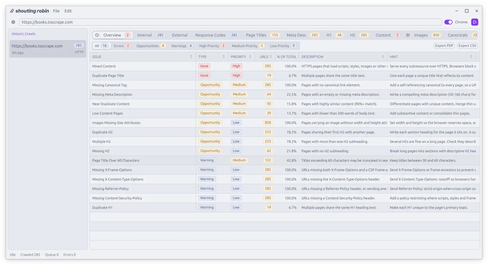

<picture>
  <source media="(prefers-color-scheme: dark)" srcset="docs/images/logo-dark.png">
  <source media="(prefers-color-scheme: light)" srcset="docs/images/logo-light.png">
  
</picture>

 

A modern, desktop SEO crawler built with [GPUI](https://www.gpui.rs) and [gpui-component](https://github.com/longbridge/gpui-component), offering fast performance and a clean interface. [Spider](https://github.com/spider-rs/spider) is used for the crawling and scraping.

<picture>
  <source media="(prefers-color-scheme: dark)" srcset="docs/images/screenshot-dark.webp">
  <source media="(prefers-color-scheme: light)" srcset="docs/images/screenshot-light.webp">
  
</picture>

## Features

- **Native Performance** - Built with Rust and GPUI for fast native performance
- **Modern UI** - Clean, responsive interface with theme support
- **Local-first** - All your data stays on your machine with no cloud dependencies
- **Cross-platform** - Available for Linux, macOS and Windows

## macOS

**IMPORTANT:** After downloading you have to run `xattr -r -d com.apple.quarantine ShoutingRobin.app` in the folder of the app since the app isn't notarized.

## License

Apache-2.0

- Icons from [Lucide](https://lucide.dev).
