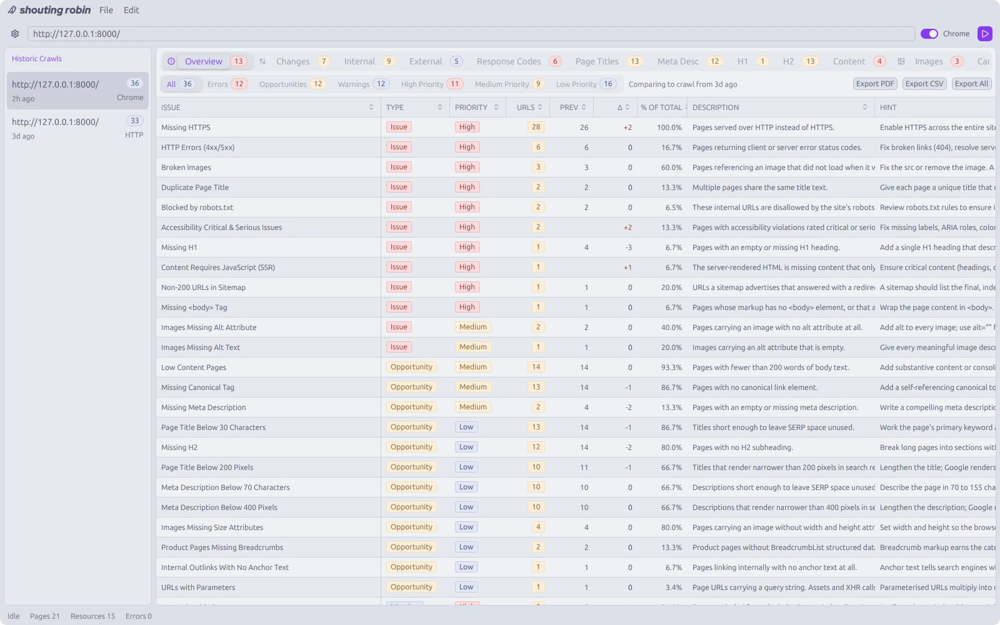

<picture>
  <source media="(prefers-color-scheme: dark)" srcset="docs/images/logo-dark.png">
  <source media="(prefers-color-scheme: light)" srcset="docs/images/logo-light.png">
  
</picture>
<hr><br>

A modern, desktop SEO crawler built with [GPUI](https://www.gpui.rs) and [gpui-kit](https://github.com/longbridge/gpui-kit), offering fast performance and a clean interface. [Spider](https://github.com/spider-rs/spider) is used for the crawling and scraping.

<picture>
  <source media="(prefers-color-scheme: dark)" srcset="docs/images/screenshots/overview-mocha.webp">
  <source media="(prefers-color-scheme: light)" srcset="docs/images/screenshots/overview-latte.webp">
  
</picture>

## Features

- **Native Performance** - Built with Rust and GPUI for fast native performance
- **Modern UI** - Clean, responsive interface with theme support
- **Local-first** - All your data stays on your machine with no cloud dependencies
- **Cross-platform** - Available for Linux, macOS and Windows

## macOS

Install with [Homebrew](https://brew.sh):

```bash
brew install --cask zanmato/tap/shouting-robin
```

**IMPORTANT:** If you download the release manually you have to run `xattr -r -d com.apple.quarantine "Shouting Robin.app"` in the folder of the app since the app isn't notarized.

## Website

The site at <https://zanmato.github.io/shouting-robin> is built from `site/`
with `scripts/build-site` and published by the release workflow.

Its screenshots in `docs/images/screenshots` come from
`scripts/screenshots/capture`. The script builds Shouting Robin with the
`screenshots` feature and runs it on a virtual X display against a throwaway
data directory, showing two crawls of `test-site/` recorded in
`scripts/screenshots/crawls.sql`.

## License

Apache-2.0

- Icons from [Lucide](https://lucide.dev).
